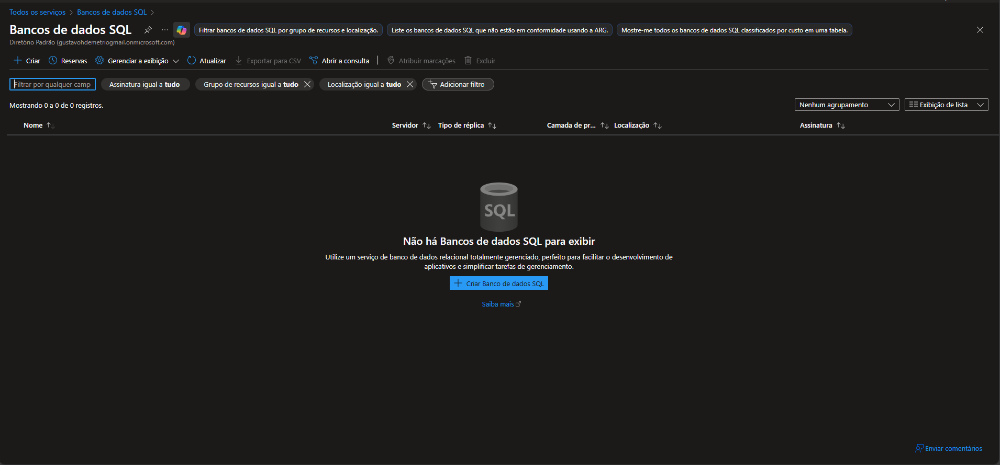
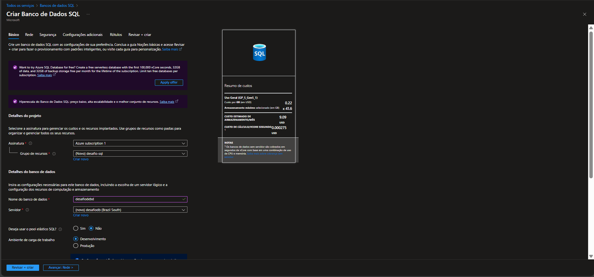
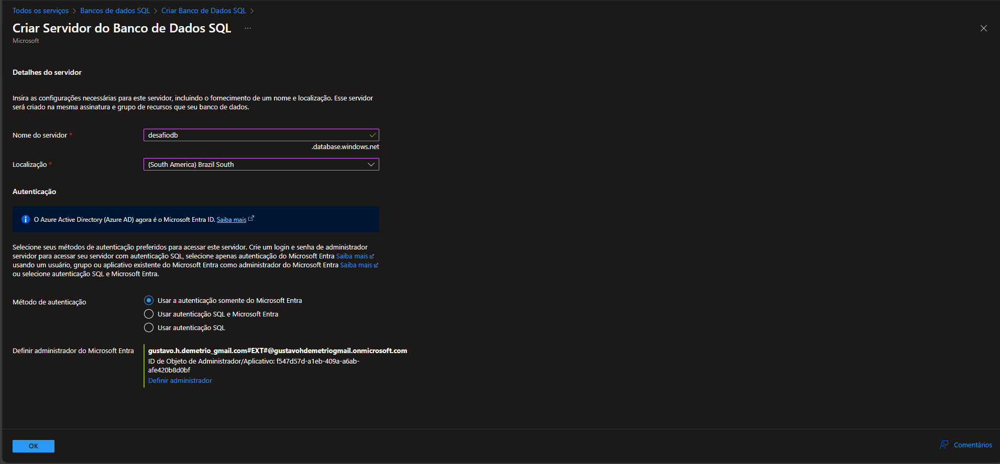
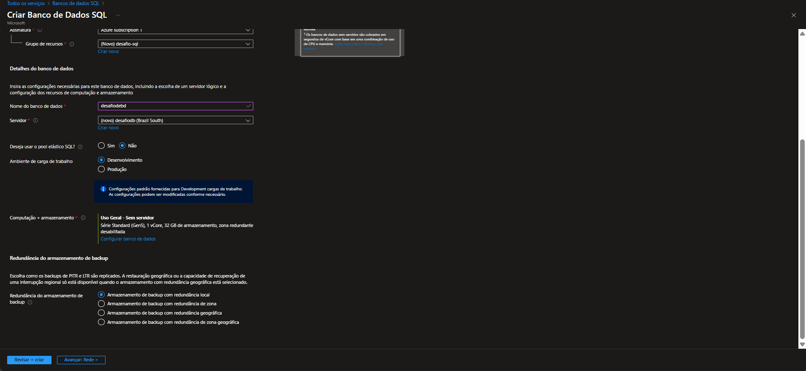
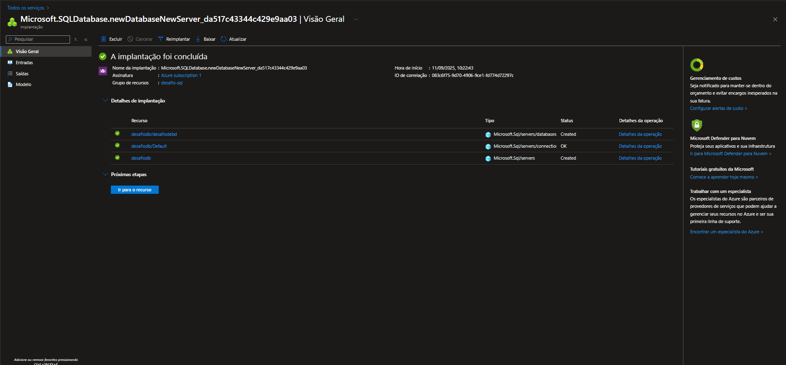
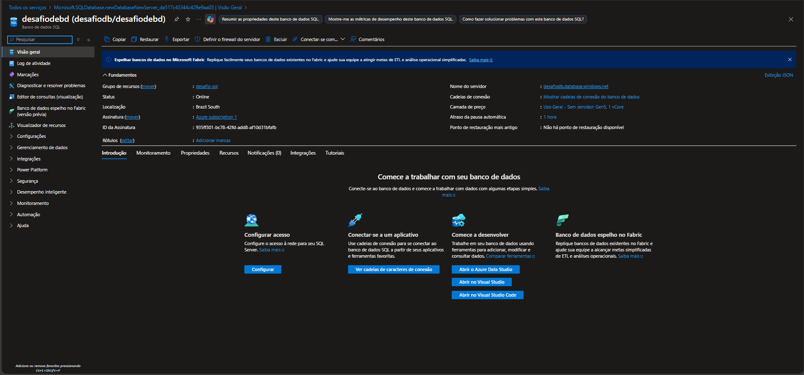

# Desafio de Projeto: Criando uma Instância de Banco de Dados SQL no Azure

> Este repositório documenta a execução do desafio de projeto do bootcamp Microsoft Azure da DIO. Seu objetivo é consolidar o conhecimento adquirido no módulo, combinando um resumo dos principais conceitos com um guia prático do processo de criação de um Banco de Dados SQL na Azure.

---

## ☁️ Módulo 1: Conceitos Fundamentais de Nuvem

### Definições e Modelos Essenciais
* **Computação em Nuvem:** É o fornecimento de serviços de computação (processamento, rede, armazenamento) pela internet, visando inovação rápida, recursos flexíveis e economia de escala.
* **Modelos de Nuvem:**
    * **Pública:** A infraestrutura pertence a um provedor externo (como a Microsoft Azure) e os recursos são compartilhados. Ideal para quem busca ausência de despesas de capital (CapEx) e pagamento conforme o uso.
    * **Privada:** Ambiente exclusivo de uma organização, garantindo controle total sobre recursos e segurança.
    * **Híbrida:** Combina as nuvens pública e privada, oferecendo máxima flexibilidade e controle.

### Modelo Financeiro: CapEx vs. OpEx
* **CapEx (Despesas de Capital):** Gasto inicial em infraestrutura física, um investimento que se deprecia com o tempo.
* **OpEx (Despesas Operacionais):** Modelo da nuvem, sem investimento inicial. Você paga apenas pelo que consome, facilitando a previsão de custos.

### Principais Benefícios da Nuvem
* **Alta Disponibilidade:** Garante que os serviços permaneçam operacionais.
* **Escalabilidade:** Permite ajustar recursos para atender à demanda (vertical ou horizontalmente).
* **Elasticidade:** Ajuste automático de recursos para lidar com picos de uso.
* **Confiabilidade e Previsibilidade:** Ambiente robusto que permite planejar custos e desempenho.
* **Segurança e Governança:** Ferramentas robustas para segurança, conformidade e gestão.

### Tipos de Serviço e Responsabilidades
* **IaaS (Infraestrutura como Serviço):** Maior flexibilidade. O cliente gerencia o SO, apps e dados.
* **PaaS (Plataforma como Serviço):** O cliente foca nos apps e dados, enquanto o provedor gerencia a plataforma.
* **SaaS (Software como Serviço):** O usuário apenas consome um software pronto (Ex: Microsoft 365).
O **Modelo de Responsabilidade Compartilhada** define quem cuida de cada camada, sendo o cliente sempre responsável por seus dados.

---

## Laboratório Prático: Criação de um Banco de Dados SQL no Azure

> Documentação do passo a passo prático para criar um Banco de Dados SQL utilizando o portal do Azure.

### 1️⃣ Acessando o Serviço de Banco de Dados SQL
> O início é a tela de "Bancos de dados SQL" do Azure. Como não temos nenhum DB, a lista está vazia. Clicando em **+ Criar Banco de dados SQL** iniciamos o processo.

### 2️⃣ Configurações Iniciais do Projeto e do Banco
> Na tela de criação, configuramos os detalhes essenciais:
> * **Assinatura**: Selecionamos a assinatura a ser utilizada.
> * **Grupo de Recursos**: Criamos um novo grupo para organizar todos os recursos do projeto.
> * **Nome do banco de dados**: Definimos um nome para o nosso DB.

### 3️⃣ Criação do Servidor
> Ao clicar em "Criar novo" na seção “Servidor”, configuramos os detalhes:
> * **Nome do servidor**: Definimos um nome único para o servidor.
> * **Localização**: Escolhemos a região mais próxima para garantir baixa latência.
> * **Autenticação**: Configuramos o método de autenticação e o administrador.

### 4️⃣ Ambiente e Redundância
> De volta à tela principal, definimos o ambiente da carga de trabalho como **Desenvolvimento**, o que otimiza os custos. Em seguida, configuramos a redundância do backup.

### 5️⃣ Confirmação da Implantação
> Após revisar tudo, o Azure provisiona os recursos. Esta tela confirma que a implantação foi **concluída com sucesso**, mostrando os recursos que foram criados.

### 6️⃣ Acessando o Banco de Dados
> Com tudo pronto, acessamos o painel de controle do banco de dados. A "Visão Geral" mostra o status **Online** e fornece as cadeias de conexão para um aplicativo.

---

## Conclusão

> Criar um Banco de Dados SQL no Azure pelo portal é bem mais simples do que parece. Neste projeto, passamos por todas as etapas, desde a configuração inicial de recursos até a confirmação de que o banco está online e pronto para uso.

---
