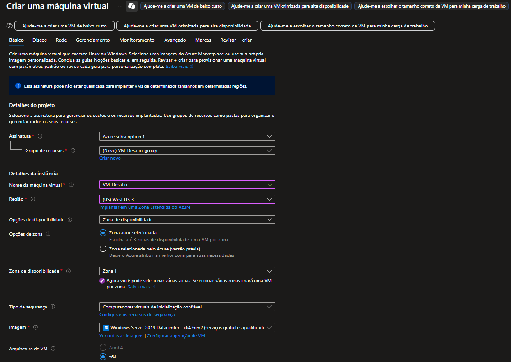
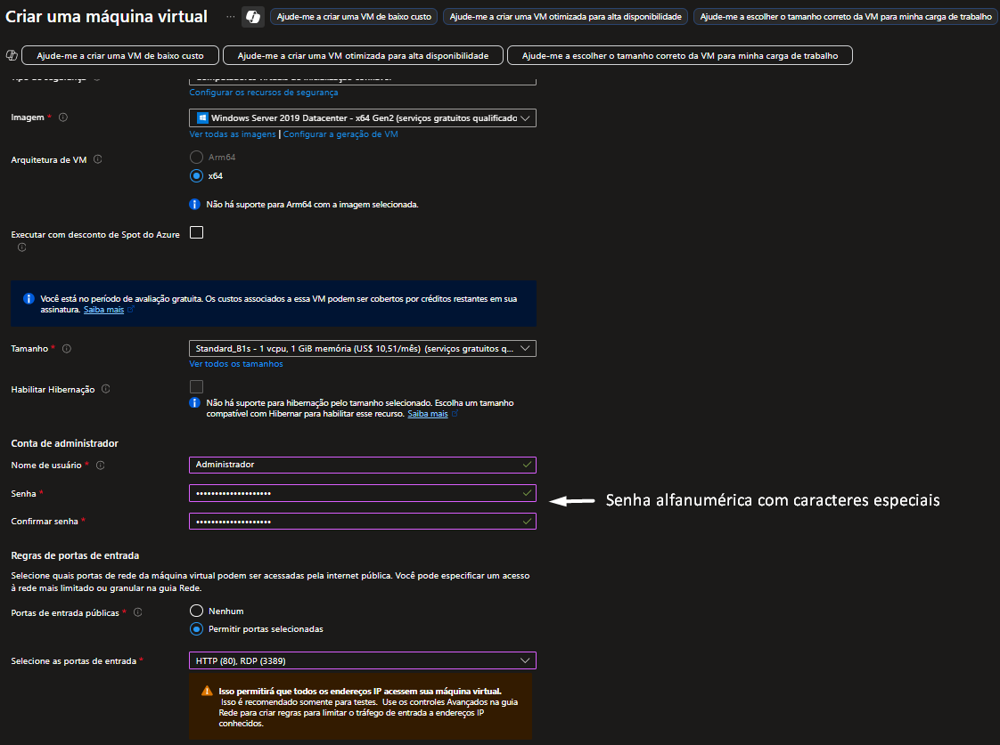
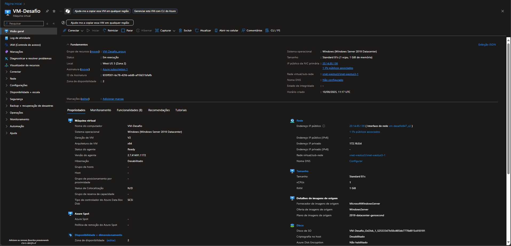
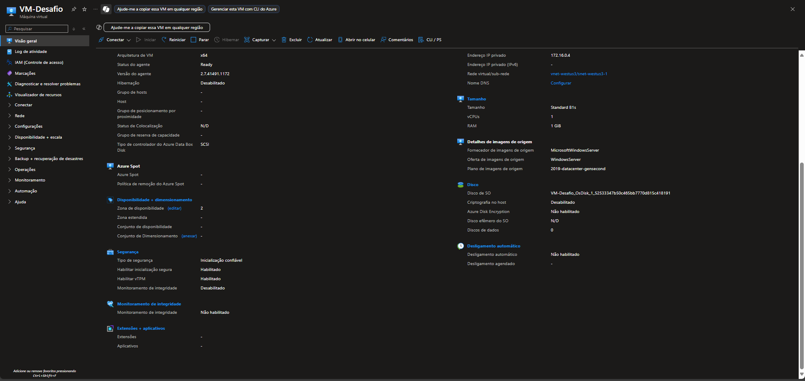
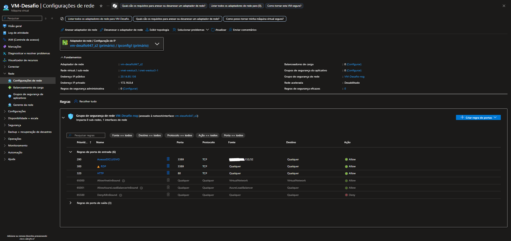
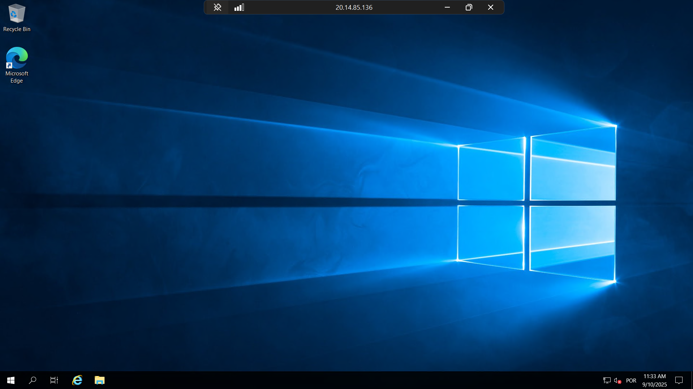

# Desafio - Criando Máquinas Virtuais no Azure

Repositório contendo a documentação do que foi compreendido do curso até o momento.

---

## Passos Realizados

1. **Criação do Grupo de Recursos e da Máquina Virtual**  
   - Definição do sistema operacional e tamanho.  
   - Configuração de rede e regra de segurança.  
   - Acesso via RDP.  

---

## Configurações da VM

- **Sistema Operacional**: Windows Server 2019 Datacenter  
- **Tamanho**: Standard_B1s  
- **Região**: East US  
- **Rede**: NSG com porta 3389 (RDP) aberta apenas para meu IP  

---

## Aprendizado

- Navegação e descoberta de serviços/aplicativos no portal da Azure.  
- Compreensão das funcionalidades e cobranças referentes aos serviços/aplicativos.  
- Adaptação à interface e aos recursos da plataforma.  
- Criação e configuração de máquinas virtuais do zero (S.O, Armazenamento, Rede, CPU/RAM, Localização).  
- Reconhecimento da importância de limitar o acesso remoto por questões de segurança.  

---

## Capturas de Tela

### Criação da VM
  
  

### Máquina Virtual Pronta
  
  

### Rede e Segurança
  

### Conexão Remota
  

---
