# Projeto Azure: Criação de Infraestrutura Básica

## Descrição do Projeto
Este projeto tem como objetivo criar uma infraestrutura básica na plataforma Microsoft Azure, utilizando máquinas virtuais (VMs), redes virtuais (VNets), contas de armazenamento e grupos de recursos. O objetivo foi aplicar os conceitos de computação em nuvem, conforme aprendido nos módulos até o momento.

## Passos Executados

### 1. Criação de Grupo de Recursos
- **Objetivo**: Criar um contêiner lógico para gerenciar os recursos.
- **Detalhes**:
  - Nome do grupo de recursos: `Cons_Arq_Azure_DIO`.
  - Localização: Região Brazil South.

**Imagem 1: Grupo de Recursos Criado**
 

 

 

 
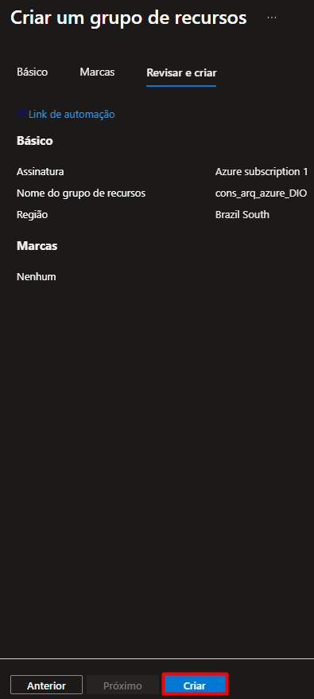
 

 

Lembre-se de nomear o grupo de recursos de acordo com a sua organização.

### 2. Criação de Máquina Virtual (VM)
- **Objetivo**: Criar e configurar uma máquina virtual no Azure.
- **Tecnologias Utilizadas**: Azure Virtual Machines, Azure Portal.
- **Detalhes**:
  - Nome da VM: `ArquiteturaDIO` (detalhe importante: o nome da VM pode ser alterado conforme necessário, conforme marcado em vermelho na imagem).
  - Sistema operacional: Windows Server 2019 Datacenter.
  - Tamanho da VM: B1s (para uso de recursos gratuitos).
  - Rede: Conectada a uma rede virtual padrão.

**Imagem 2: Criação da VM**
 
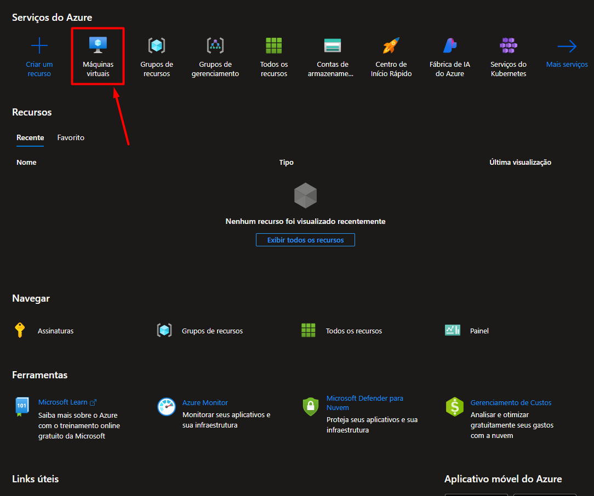
 
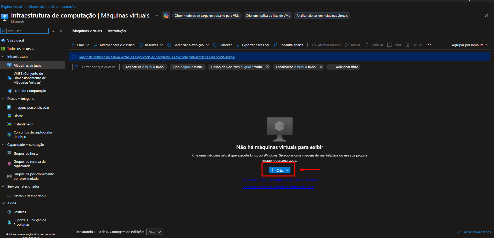
 
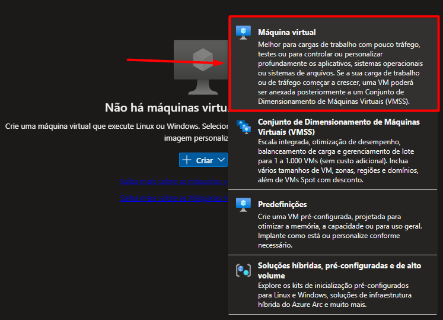
 
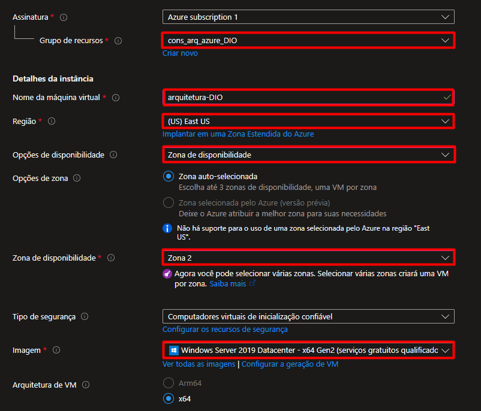
 
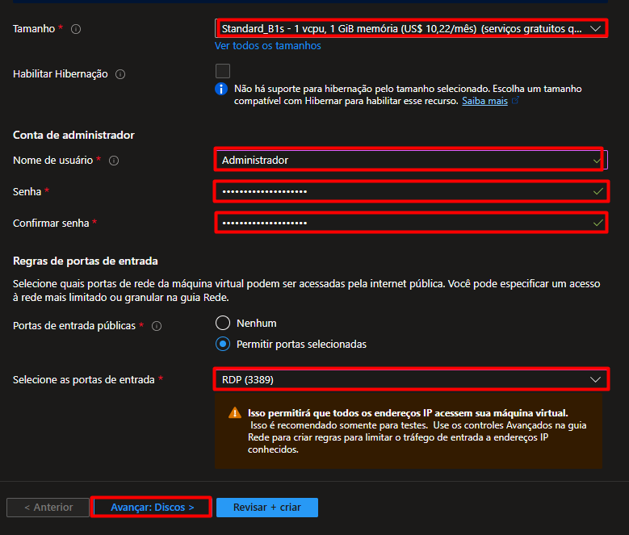
 
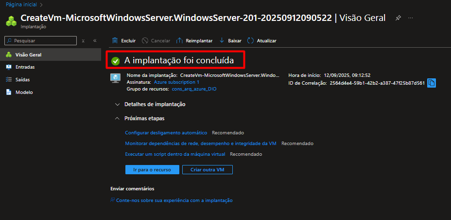
 
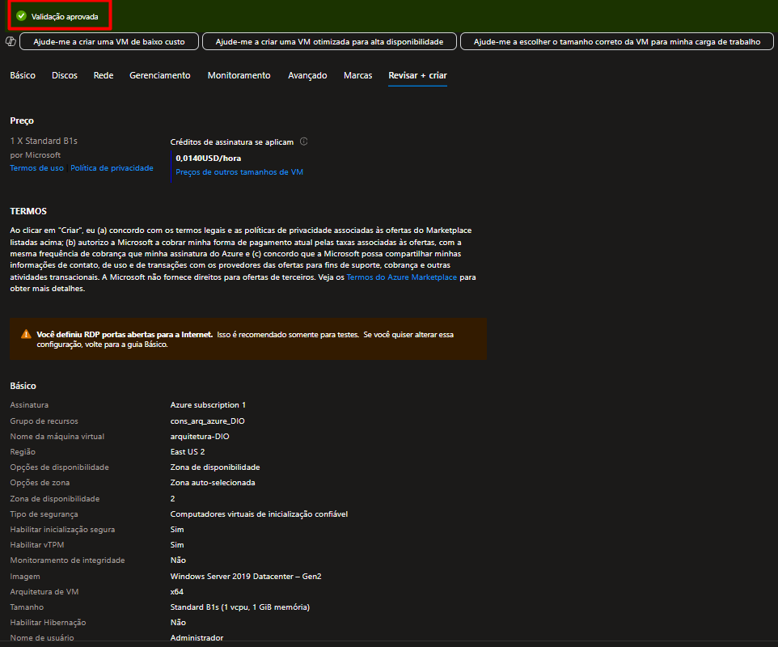
 
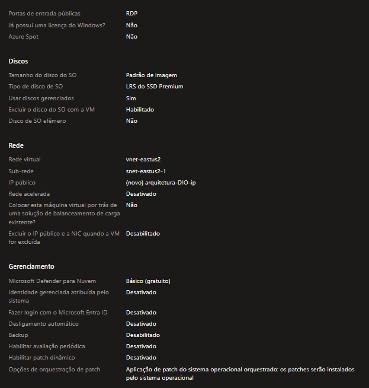
 
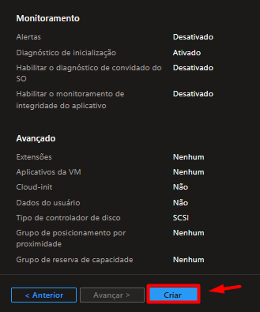
 

Na imagem acima, podemos ver o processo de criação da VM.

### 3. Criação de Rede Virtual (VNet)
- **Objetivo**: Configurar uma rede privada para conectar os recursos da Azure.
- **Detalhes**:
  - Nome da VNet: `MinhaVNet`. (altere para o nome da sua rede)
  - Sub-redes configuradas: `Padrão`.
  - A rede foi configurada com o bloco de IPs `10.0.0.0/16` para permitir a comunicação entre os recursos.

**Imagem 3: Rede Virtual Criada**
 

 
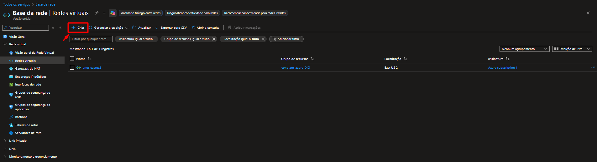
 
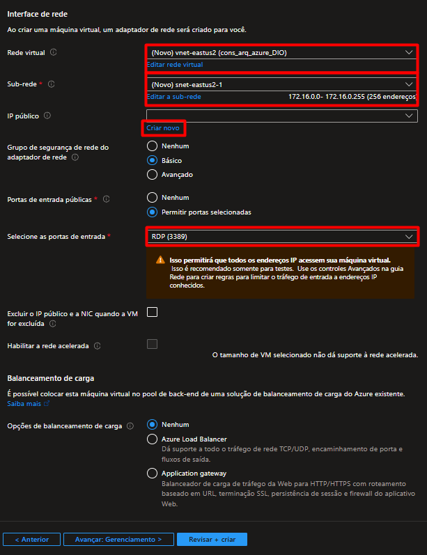
 
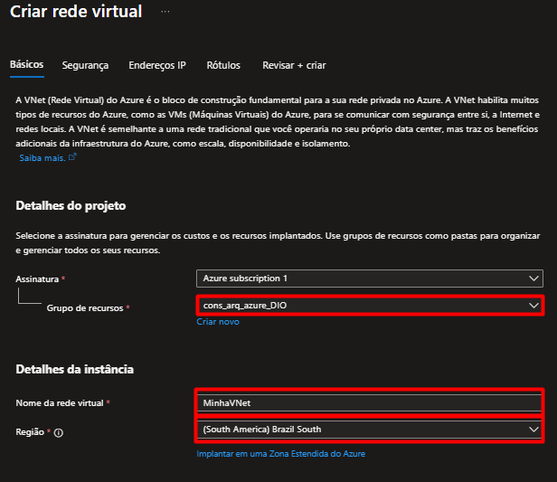
 
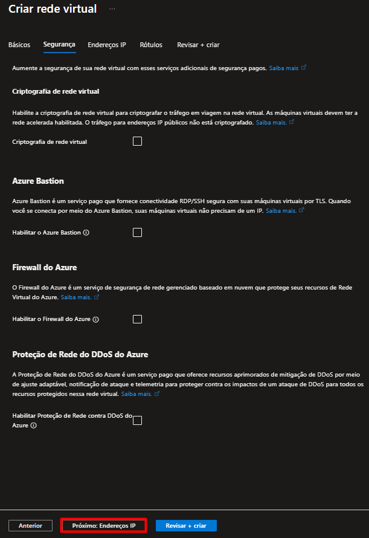
 
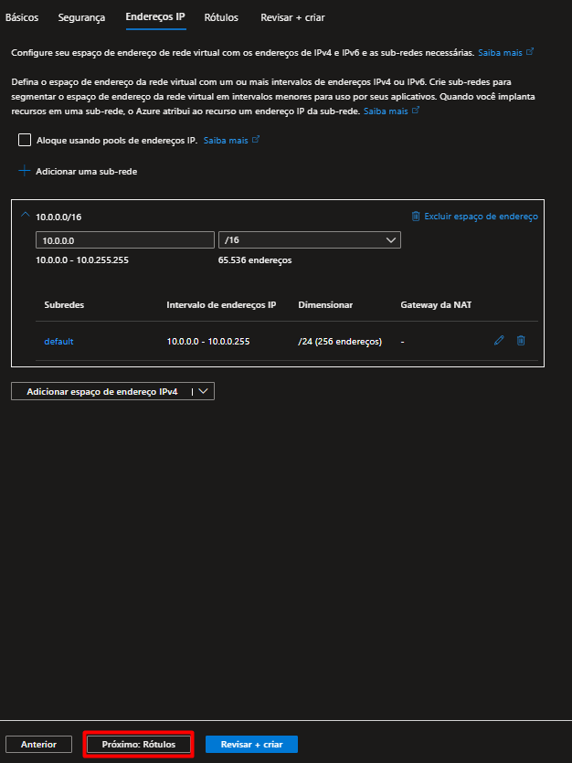
 
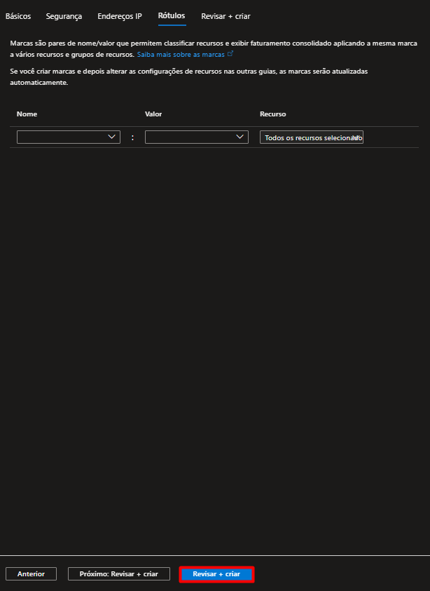
 
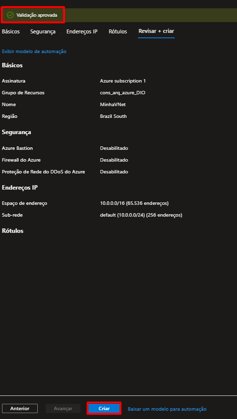
 
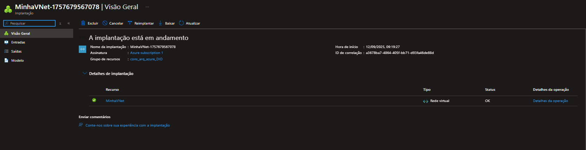
 

Na imagem acima, a rede virtual foi criada com sucesso.

### 4. Criação de Armazenamento
- **Objetivo**: Criar uma conta de armazenamento para persistir dados na Azure.
- **Detalhes**:
  - Tipo de armazenamento: Blob Storage.
  - Nome da conta de armazenamento: `SaveDIO`. (altere para o nome do seu armazenamento)
  - A replicação escolhida foi **Armazenamento com redundância geográfica (GRS)**. (altere para o que for melhor para você)

**Imagem 4: Armazenamento Criado**
 
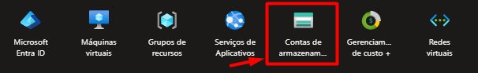
 
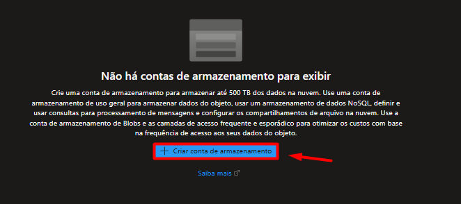
 
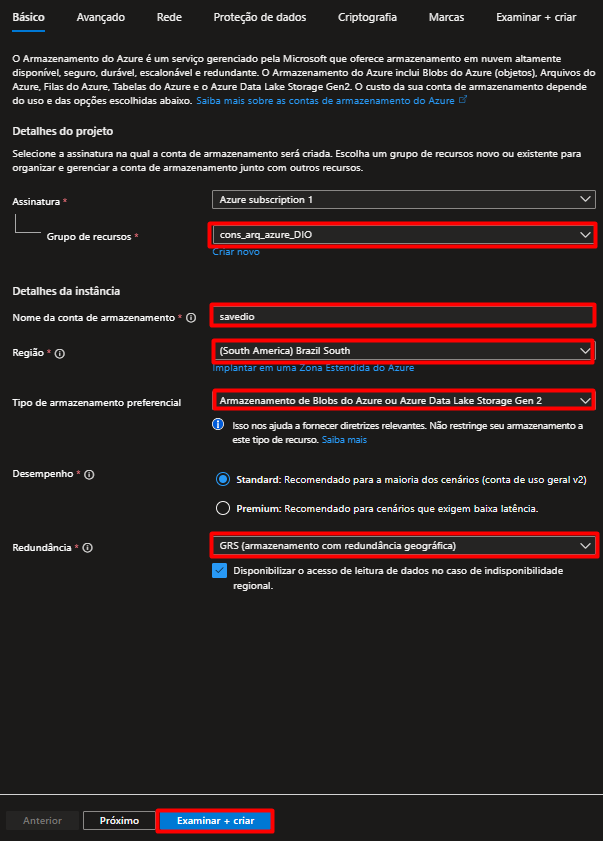
 
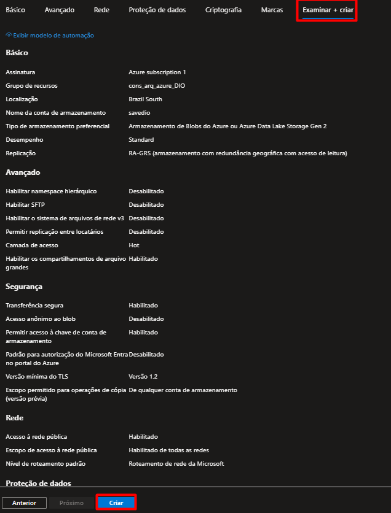
 

## Como Executar

Para rodar este projeto, siga os seguintes passos:
1. **Criação de Grupo de Recursos**: Crie um grupo de recursos para gerenciar todos os recursos criados.
2. **Criação de Máquina Virtual**: Use o portal do Azure para seguir os passos descritos.
3. **Criação de Rede Virtual**: Crie uma VNet com a sub-rede especificada.
4. **Criação de Armazenamento**: Siga os passos para criar uma conta de armazenamento.

## Links Úteis
- [Documentação oficial do Azure](https://docs.microsoft.com/en-us/azure/)
- [Tutorial sobre criação de VMs no Azure](https://docs.microsoft.com/en-us/azure/virtual-machines/)
