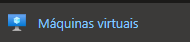
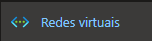

# Resumo do Lab – Formação AZ-900 (DIO)

Repositório contendo um resumo das lições aprendidas durante o desenvolvimento do laboratório na DIO.

---

## Índice

1. [Objetivo do Lab](#objetivo-do-lab)  
2. [Aprendizados](#aprendizados)  
3. [Passo a Passo](#passo-a-passo)  
4. [Capturas de Tela](#capturas-de-tela)  
5. [Conclusão](#conclusão)  

---

## Objetivo do Lab

O objetivo deste laboratório foi praticar a configuração de recursos no Azure e aplicar na prática os conceitos aprendidos durante a formação AZ-900, como computação em nuvem, máquinas virtuais, redes e serviços gerenciados.

---

## Aprendizados

Durante o laboratório no Microsoft Azure, aprendi conceitos fundamentais sobre computação em nuvem e como utilizá-los na prática:

- **Portal do Azure**: Navegação pelo portal, localização e pesquisa de serviços.  
- **Máquinas Virtuais (VMs)**: Criação e configuração de VMs, entendendo como definir sistema operacional, tamanhos, rede e armazenamento.  
- **Redes Virtuais**: Conceitos de IP, firewall, regras de segurança e conectividade entre recursos.  
- **Serviços do Azure**: Visão geral de outros serviços disponíveis, como banco de dados, monitoramento e armazenamento.  
- **Modelo baseado em consumo**: Entendimento de que os recursos na nuvem são cobrados de acordo com o uso, permitindo escalabilidade e melhor previsão de custos.  
- **Segurança e Governança**: Importância de configurar acessos, permissões e boas práticas de segurança no ambiente em nuvem.  

---

## Passo a Passo

Exemplo de passo a passo ilustrativo, com dicas:

1. **Acessar o portal do Azure**  
   - Use seu login da DIO ou Microsoft Account.  
   - Dica: Explore a barra de pesquisa para localizar serviços rapidamente.  

2. **Criar uma nova Máquina Virtual (VM)**  
   - Selecionar sistema operacional: Windows Server 2022 ou Ubuntu.  
   - Definir tamanho da VM (ex.: 2 vCPU, 8GB RAM).  
   - Configurar rede e regras de firewall.  
   - Dica: Sempre use grupos de segurança (NSG) para limitar acesso externo.  

3. **Configurar Redes Virtuais (VNet)**  
   - Criar sub-redes para separar recursos.  
   - Ajustar IPs e regras de roteamento.  

4. **Configurar Armazenamento**  
   - Criar discos de dados adicionais se necessário.  
   - Habilitar backup e snapshots para segurança.  

5. **Testar Conectividade e Acessos**  
   - Conectar via RDP (Windows) ou SSH (Linux).  
   - Validar comunicação entre VMs e outros serviços do Azure.  

---

## Capturas de Tela

### Criação de Máquina Virtual

### Configuração de Rede

### VM pronta no Bastion

### Armazenamento

## Conclusão

O laboratório foi essencial para consolidar minha compreensão inicial sobre a nuvem e me mostrou, na prática, como o Azure facilita a criação e o gerenciamento de recursos. Esse aprendizado também reforça como a nuvem da Microsoft oferece diferentes formas de uso para atender várias necessidades, desde criar infraestrutura até usar ferramentas prontas.
